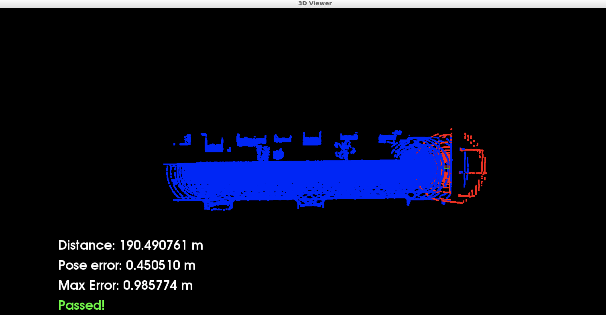

# Scan Matching Localization
By Navjot Kaur

The goal of this project is to localize a virtual car driving straight along a road in a simulated traffic scenario for at least 170m from the starting position never exceeding a 2D position error of 1.2 m at maximum. The virtual car in the simulation is equipped with a lidar sensor that scans its environment. The simulator provides lidar scans at regular intervals. Additionally, a point cloud map map.pcd of the environment is provided. This point cloud map has been extracted from a demo environment of the CARLA simulator. By using point registration matching between this point cloud map and the incoming lidar scans, localization for the car can be accomplished at every time step. Therefore, a transformation matrix is calculated that maps the lidar point cloud from the current scan in an optial way to the point cloud map. This transformation is used to correct the current pose estimate of the virtual car with resepct to the map.

### Installation

This is the third project of Udacity Self-Driving Car Engineer Nanodegree program of the Lesson 3 "Localization".

### Results

Using ICP resulted into a 0.95 max pose error:


While using NDT resulted into a 0.77 max pose error:


### Usage

To run the program in the Udacity workspace the following steps need to be taken:

1 - Compile the code (Terminal Tab 1)
```
cd /home/workspace/c3-project

cmake .

make
```

2 - Launch the simulator in a new terminal tab (Terminal Tab 2)

```
su - student

cd /home/workspace/c3-project

./run-carla.sh

```

